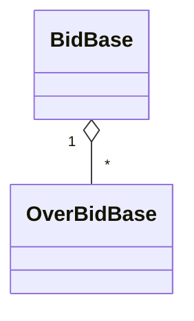

# BidChain
Bid on blockchain

The purpose of this project is to create a bid and make overbid.

# Class Diagram

# How to make a bid 

* use the BidBase#createBid method.
  * parameter : 
    * name (eg. gameboy color);

# how to make an overbid 

To make an overbid you must have a bid address deployed on the blockchain. (see [OverbidBase.test.js](test/OverbidBase.test.js#L28)).

Thereby to create an overbid, you should use OverbideBase#createOverbid method.
* parameter :
  * price
  * bid address deployed 

